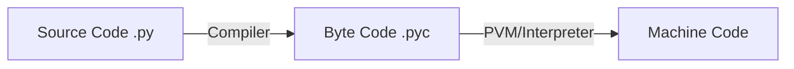

# Python

##### Code execution process

- The Python excutes it's code by converting it to the `platform independent intermediate code` i.e. `byte code` with extension `.pyc` and then to the binary.
- The source is taken from the .py file and then compiled into the byte code, doing this makes the code platform independent(Combination of OS and Architecture(like intel architecture they together form a platform.)) .
- Now you can run this code in any system where python is installed even Java works on the same principals.
- Then the code is converted into binary line by line Interpretation happens here.
- Now PVM plays the role which is specific to the platform i.e. it is platform dependent.



> ![NOTE]
> Now if you want to see the compiled code then run `python3 -m py-compile file.py`.

> If you ever want to get the memory address of an object then you can use id() function.  
> In python if a=10 and b=10 then memory address of both the variables will be same because they have same literals and same is true for strings.

### General purpose functions

These functions will work for numbers but for string they work in the following ways:  
|Funtion|Description|
| ----- | --------- |
|max()|will also work for string and sort it lexicographically.|
|min()|same as above.|
|sum()| will not work for strings.|
|reverse()|will reverse the order in a way it was inserted.|
|sort()|same as above.|
|update()|will update with certain values.|
|clear()|will clear out all elements but the structure(Eg-list or set) will remain as it is.|
|del()|it does not accept literal instead it asks for variable and delete it entirely even structures.|
|count()|will give the count of elements|
|len()|will give the length of elements|
|var[a:b]|will always slice elements where a is inclusive and b is exclusive.|

### LIST

---

```python
list=[]     #empty list
#can be accessed using the indices.

- Adding an element
list.append('obj')  #will add at the end of the list.
list.insert(1,5)    #will insert the 5 at 1 indice.

- Searching for the element
list.index(element) #it takes element as an argument and revels the position of that element.
list.index(ele, 4,7)#will search for the element from 4th index to 6th index position.

- Slicing an element
list[1:4]           #will print the elements from 1st to 3rd index.

- Removing the element
list.remove(element)# the element from the list not an index.
list.pop()          #removes last element and prints the removed element.
list.pop(index)     #can also be given index.
list.del(index)     #will delete the literal at that index
list.del[0:2]       #will delete elements within the provided range **remember 0 is inclusive and 2 is exclusive**.
```

### Tuples

---

Tuples are faster and also memory efficient than lists.

> ![NOTE]
> To create a single tuple we must place at least 1 comma(,) then and then only the tuple can be craeted.

As the tuples are immutable anything that modifies the elements will throw an error like sort(),reverse(),insert(),etc otherwise same as list.

> ![CAUTION]
> Tuples can also be created with a single element, but it is a bit tricky. Having one element in the parentheses is not sufficient, there must be a trailing ‘comma’ to make it a tuple.

### Sets

Set is a collection of distinct items. They are unordered hence they can't be accessed. Uses hashing internally and faster in set operations.

```python
- Creating sets
s1={1,2,4}
s2=([5,1,6])    #set constructor

- Removing an element.
s.discard(element)      #does not do anything if element is not present
s.remove(element)       #will raise an error if element is not present.


```

> ![CAUTION]
> s={} will not create an empty set it will create an empty dictionary.
> s=set() is the correct to create an empty set.

> ![NOTE]
> In Python whenever you take a input in list it stores as string by default and also seperate as as an individual number. Eg-25->'2','5'.
