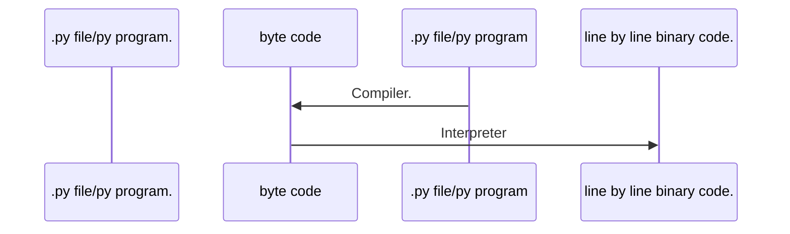

# Python

##### Code execution process

> The Python excutes it's code by converting it to the byte code and then to the binary.

> Note: In Python whenever you take a input in list it stores as string by default and also seperate as as an individual number. Eg-25->'2','5'.
