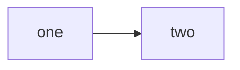

[For more info follow this documentation.](https://docs.github.com/en/get-started/writing-on-github/getting-started-with-writing-and-formatting-on-github/basic-writing-and-formatting-syntax)

```Python
print("Hello world.")
```

> [!NOTE]
> This is important note.

> [!IMPORTANT]
> this is imp now.

> [!TIP]
> This is tip

> [!WARNING]
> this is last warning.

> [!CAUTION]
> this is last caution.

### For instering flowcharts.

---

---

[For more diagrams checkout this documentation by mermaid.](https://mermaid.js.org/syntax/flowchart.html#a-node-default)



```shell
echo hello world
```

### To colour the text (from Latex colored math symbol.)

$\color{red}\text{This is red text}$  
$\color{blue}\text{This is blue text}$  
$\color{green}\text{This is green text}$  
$\color{purple}\text{This is purple text}$  

### Dynamoic writing urls
    [](https://readme-typing-svg.herokuapp.com/demo/)  
    [](https://github.com/DenverCoder1/readme-typing-svg?tab=readme-ov-file)  

### Task List
- [x] this is a complete item   
- [ ] this is an incomplete item  

### Creating a table
First Header | Second Header 
 ------------ | ------------- 
Content from cell 1 | Content from cell 2 
Content in the first column | content in the second column 

### Mathematical Expressions
$$\sqrt{3}+1$$  
(https://docs.github.com/en/get-started/writing-on-github/working-with-advanced-formatting/writing-mathematical-expressions)  


